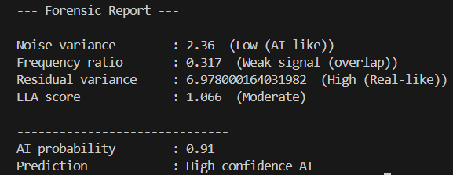
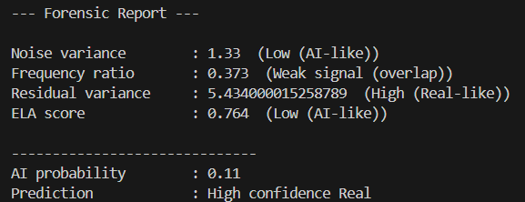

# AI Image Detection using Explainable Forensic Features

## Overview
This project detects whether an image is AI-generated or real using interpretable forensic signals instead of deep learning.

## Key Idea
Instead of using black-box models, this system analyzes:
- Noise patterns
- Frequency distribution (FFT)
- Residual noise
- Compression artifacts (ELA)

## Features Used
- Noise Variance (Laplacian)
- Frequency Analysis (FFT)
- Residual Noise Analysis
- Error Level Analysis (ELA)

## Model
- Random Forest Classifier
- Probability Calibration
- Feature Scaling + Log Transformation

## Dataset
- This project was trained on the CIFAKE dataset (~60,000 images).
- Dataset is not included due to size constraints.

## Performance
- Accuracy: ~75%
- Balanced performance across real and AI images

## Sample Output


--- Forensic Report ---

Noise variance : 6.81 (Moderate)
Frequency ratio : 0.76 (Weak signal)
Residual variance : 2.14 (Low - AI-like)
ELA score : 1.32 (Moderate)

AI probability : 0.68
Prediction : Likely AI (medium confidence)

## Installation
```bash
pip install -r requirements.txt
``` 
## Setup (First Time)
Since the trained model is not included due to size limitations, run:
```bash
python train_models.py
```
## Usage
```bash
python detect.py "image.jpg"
```
## Tech Stack
Python
OpenCV
NumPy
Scikit-learn

## Key Learnings
Feature engineering for image forensics
Model calibration and scaling
Handling real-world data distribution issues
Importance of explainability in AI systems

## Limitations
Performance drops on heavily compressed or edited images
Feature overlap between real and AI images

## Future Work
Add wavelet-based texture features
Incorporate color channel analysis
Hybrid model with deep learning

## Note
Pre-trained model (model.pkl) and scaler (scaler.pkl) are included for direct usage.


## 📸 Sample Outputs

### AI Image Detection


### Real Image Detection



## Conclusion

This project demonstrates that AI-generated images can be identified using
interpretable forensic signals such as noise patterns, frequency characteristics,
residual artifacts, and compression inconsistencies.

While modern AI models produce highly realistic images, they still leave subtle
statistical traces that can be captured using feature-based analysis. This system
achieves around 75% accuracy using a lightweight and explainable approach.

The key takeaway is that explainability and simplicity can still provide meaningful
insights in complex problems like AI image detection, and this approach can serve
as a strong foundation for building more advanced hybrid systems in the future.

This work highlights the importance of interpretable AI systems, especially in
forensic and trust-critical applications where understanding the decision process
is as important as the prediction itself.